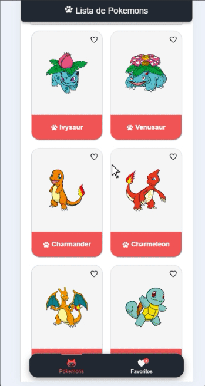

# Aplicativo Pokedex :iphone:

Aplicativo Pokedex escrito em ionic, o aplicativo utiliza
a API https://pokeapi.co/ para consultar as informações e faz a construção de uma interface para a interação com a mesma.

# Sumário :memo:

<!--ts-->
   1. [Sumário](#Sumário)
   2. [Estrutura do projeto](#Estrutura-do-projeto)
   3. [Pré-requisitos](#Pré-requisitos)
   4. [Instalação](#Instalação)
   5. [Capturas de tela](#Capturas-de-tela)
   6. [Tecnologias](#Tecnologias)
<!--te-->

# Estrutura das pastas :file_folder:

O aplicativo foi dividido em 4 pastas sendo elas:

| path  |  Descrição  |
| ------------------- | ------------------- |
|  /components/ | Pasta onde os components da aplicação são armazendos. |
|  /modules/ |  pasta onde os módulos comparilhados são armazenados. |
|  /pages/  |  Pasta onde fica armazenadas as páginas do aplicativo.
|  /services/ | Pasta onde fica armazenado os services utilizados no aplicativo.


# Pré-requisitos :bookmark_tabs:

Antes de começar, você precisa ter instalado em sua máquina as seguintes ferramentas: <br>

<!--ts-->
   1. [Node](#1-Node)
   2. [Ionic](#2-Ionic)
<!--te-->

### 1. Node
Vá ate o site https://nodejs.org/en/download/package-manager e site os passos de instalação. <br>

### 2. Ionic

Após instalar o Node execute o comando abaixo para instalar o ionic.

```
npm install -g @ionic/cli
```

# Instalação :wrench:

Após instalar o Node e ionic, Execute o comando dentro da pasta do projeto para instalar as dependências do projeto.

```
npm install
```

Após executar o NPM install, rode o server do Ionic.

```
ionic serve
```

Se tudo ocorreu como esperado basta acessar o site a seguir para ter acesso a tela do aplicativo: http://localhost:8100/

# Capturas de tela :computer:

Capturas de tela do aplicativo abaixo.




# Tecnologias


